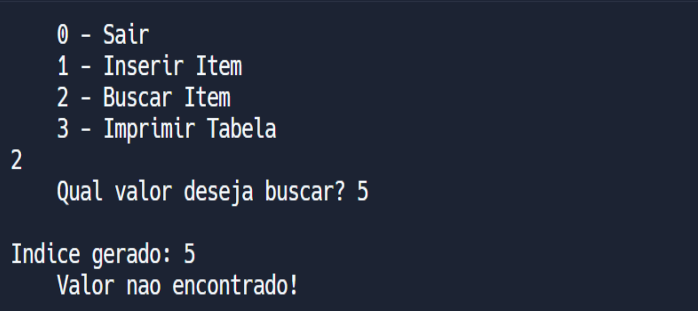
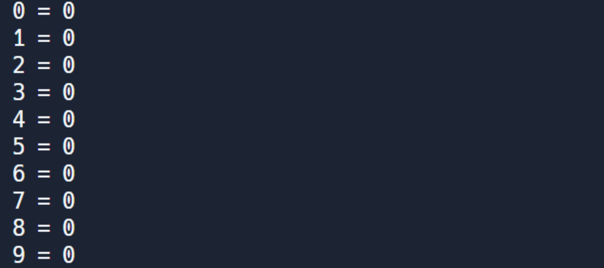
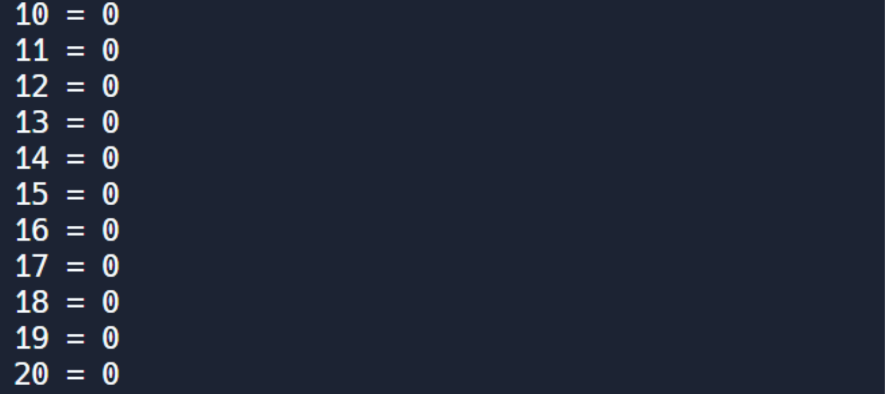

# Ponderada_sem3

# Caso de teste 1: Inserção de valores na Tabela

- <b>Pré-condição: </b> Rodar o código da tabela Hash
- <b>Etapas do Teste: </b> 
    * Inserir o número "23" na tabela
    * Inserir o número "41" na tabela

- <b> Pós-condição: </b> Verificar se a adiação de itens na tabela foi realizada com sucesso

-  <b> Resultado: </b> Aprovado com sucesso no teste
    
   

 
Figura 01 - Inicialização do código 
</img>
Fonte: Elaborado pelo autor.

 
Figura 02 - Visualização da tabela 
</img>
Fonte: Elaborado pelo autor.

# Caso de Teste 2: Busca de ítens na tabela
- <b>Pré-condição: </b> Ter dados já inseridos na tabela Hash
- <b>Etapas do Teste: </b> 
    * Buscar o número "23" na tabela
    * Buscar o número "41" na tabela

- <b> Pós-condição: </b> Verificar se ambos os números foram encontrados com sucesso em seus devidos locais

-  <b> Resultado: </b> Aprovado com sucesso no teste
    
   

 
Figura 03 - Primeira busca 
</img>
Fonte: Elaborado pelo autor.

 
Figura 04 - Segunda busca 
</img>
Fonte: Elaborado pelo autor.

# Caso de Teste 3: Buscar valor inexistente
- <b>Pré-condição: </b> Ter inicializado o código
- <b>Etapas do Teste: </b> 
    * Buscar o número "5" na tabela
    * Buscar o número "10" na tabela

- <b> Pós-condição: </b> Verificar se ambos os números não foram encontrados
-  <b> Resultado: </b> Aprovado com sucesso no teste
    
   

 
Figura 05 - Primeira busca pelo número inexistente 
</img>
Fonte: Elaborado pelo autor.

 
Figura 06 - Segunda busca pelo número inexistente 
</img>
Fonte: Elaborado pelo autor.

# Caso de Teste 4: Tratamento de Colisões
- <b>Pré-condição: </b> Inicializar o código da tabela hash
- <b>Etapas do Teste: </b> 
    * Inserir na tabela o número "15"
    * Buscar o número "46" na tabela

- <b> Pós-condição: </b> Verificar se houve o tratamento de colisão no caso supracitado

-  <b> Resultado: </b> Aprovado com sucesso no teste
    
   

 
Figura 07 - Inserção de Itens que colidem 
</img>
Fonte: Elaborado pelo autor.

 
Figura 08 - Visualização da tabela impressa 
</img>
Fonte: Elaborado pelo autor.

# Caso de Teste 5: Impressão de tabela hash
- <b>Pré-condição: </b> Inicializar o código da tabela hash e não adicionar ítens na tabela
- <b>Etapas do Teste: </b> 
    * Imprimir a tabela vazia

- <b> Pós-condição: </b> Verificar se a tabela vazia foi de fato impressa sem alterações

-  <b> Resultado: </b> Aprovado com sucesso no teste
    

 
Figura 09 - Input para impressão da tabela 
</img>
Fonte: Elaborado pelo autor.

 
Figura 10 - Parte 1 da tabela 
</img>
Fonte: Elaborado pelo autor.

 
Figura 11 - Parte 2 da tabela 
</img>
Fonte: Elaborado pelo autor.

 
Figura 12 - Parte 3 da tabela 
</img>
Fonte: Elaborado pelo autor.

